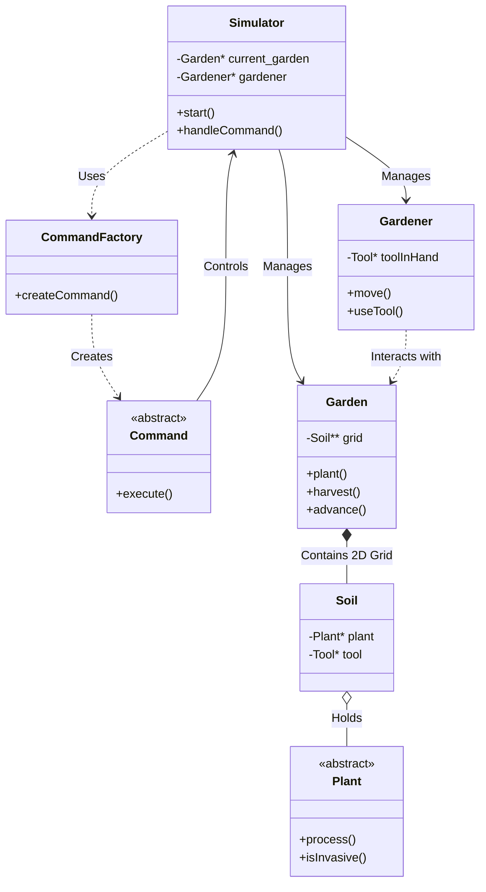

# Garden Simulator

**Author:** Tiago Carreira

## 1. Overview
This project is a text-based Garden Simulator developed in C++. It simulates a biological environment where a gardener interacts with plants, tools, and the soil. The simulation runs in turns (instants), where plants grow, die, or reproduce, and the gardener can perform various actions to maintain the garden.

The application was built emphasizing Object-Oriented Programming (OOP) principles, ensuring modularity, extensibility, and separation of concerns.

This project was developed as an academic project with a strong focus on object-oriented design and clean architecture.


## 2. Architecture
The system architecture follows a **Model-View-Controller (MVC)** inspired approach adapted for a console application.



### Core Components
*   **Simulator (Controller)**: The main engine of the application. It manages the game loop, handles user input, and maintains the state of the `Garden` and `Gardener`. It serves as the context for the **Command Pattern**.
*   **Command Factory**: Responsible for parsing text input and instantiating the correct `Command` subclass (Factory Method pattern).
*   **Garden (Model)**: Represents the environment. It manages a grid of `Soil` objects and handles biological logic (plant growth, reproduction, death).
*   **Gardener (Actor)**: Represents the user's avatar. Holds state like position, tools inventory, and current tool in hand.
*   **Plants & Tools**: Polymorphic hierarchies representing the entities in the world.

## 3. Design Decisions & Patterns

### 3.1. Command Pattern (Behavioral)
Implemented the **Command Pattern** to handle user inputs.
*   **Why**: To decouple the user input parsing from the execution logic. This allows for scalable command addition (e.g., adding a new command requires only creating a new class and registering it in the Factory) and enables features like executing commands from a file easily.
*   **Implementation**: The `Command` abstract base class defines an `execute()` method. Concrete commands (e.g., `PlantCmd`, `MoveCmd`) implement specific logic.

### 3.2. Factory Pattern (Creational)
*   **Why**: To centralize object creation based on input strings / symbols.
*   **Implementation**: `CommandFactory` creates commands from strings. `Plant::create(char)` creates plants from characters.

### 3.3. Polymorphism & Extensibility
*   **Plant Behavior**: Instead of complex `switch` statements to handle different plant types (Weed vs Flower), we used virtual methods (`process`, `wantsToMultiply`, `isInvasive`).
*   **Example**: The `isInvasive()` method allows the Garden to handle Weeds generically without needing to know the specific subclass `Weed`.

### 3.4. Memory Management
*   **Ownership**: The `Garden` owns the `Soil` grid. `Soil` owns `Plant` and `Tool` pointers. The `Simulator` owns the `Garden` and `Gardener`.
*   **RAII**: Destructors are implemented to ensure no memory leaks occur when the Garden is deleted or reset.

## 4. Learning Outcomes
This project reinforced several key C++ and software engineering concepts:
*   **Advanced C++ Implementation**: Deep understanding of manual memory management (pointers, `new`/`delete`), references, and the `const` correctness.
*   **Polymorphism in Practice**: Real-world application of virtual functions and abstract classes to reduce code duplication and conditional logic.
*   **Refactoring**: The importance of code readability. Performed a major refactoring phase to translating the codebase from Portuguese to English and standardizing naming conventions, which significantly improved code maintainability.
*   **Input Validation**: robust parsing using `std::stringstream` to handle various user input edge cases.

## 5. Possible Improvements
- Replace raw pointers with smart pointers (`std::unique_ptr`) to further improve safety.
- Add unit tests for command execution and plant behavior.
- Introduce persistence using a database-backed storage system.

## 6. How to Build & Run

### Prerequisites
- C++ Compiler (C++17 standard)
- CMake (optional)

### Build
```bash
mkdir build
cd build
cmake ..
cmake --build .
```

### Run
```bash
./GardenSimulator
```
